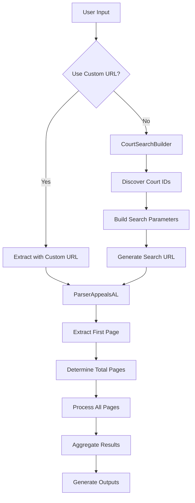
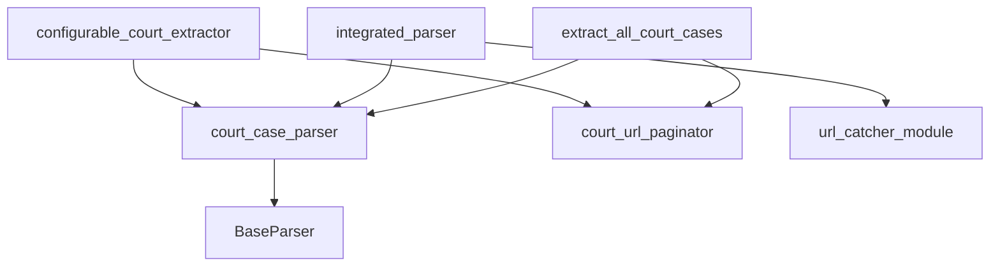

# Parser Classes Overview

Complete reference for all OPAL parser classes and their integration points.

## Core Components

### ParserAppealsAL

The main court parser for Alabama Appeals Court system.

```python
from opal.court_case_parser import ParserAppealsAL

parser = ParserAppealsAL(
    headless=True,
    rate_limit_seconds=3
)

# Parse a specific URL
result = parser.parse_article(url)

# Process all court cases from a search
cases = parser.parse_all_cases(base_url, page_urls)
```

**Constructor Parameters:**
- `headless` (bool): Run browser in headless mode (default: True)
- `rate_limit_seconds` (int): Seconds between requests (default: 3)

**Key Methods:**
- `parse_article(url)` - Parse single page/URL
- `parse_all_cases(base_url, page_urls)` - Parse multiple pages
- `_setup_driver()` - Initialize WebDriver
- `_close_driver()` - Clean up WebDriver

### CourtSearchBuilder

Builder class for constructing Alabama Court search URLs with court-specific parameters.

```python
from opal.configurable_court_extractor import CourtSearchBuilder

# Create builder
builder = CourtSearchBuilder()

# Configure search
builder.set_court("civil")
builder.set_date_range(period="1m")
builder.set_case_category("Appeal")
builder.set_exclude_closed(True)

# Build URL
search_url = builder.build_url(page_number=0)
```

**Available Methods:**

**Court Configuration:**
- `set_court(court_key)` - Set court ('civil', 'criminal', 'supreme')
- `get_court_info()` - Get current court information
- `discover_court_ids(parser_instance)` - Auto-discover court IDs
- `set_court_id_manually(court_key, court_id)` - Manual court ID override

**Search Parameters:**
- `set_date_range(start_date=None, end_date=None, period='1y')` - Date filtering
- `set_case_category(category_name=None)` - Case type filtering
- `set_case_number_filter(case_number=None)` - Case number filtering
- `set_case_title_filter(title=None)` - Case title filtering
- `set_exclude_closed(exclude=False)` - Exclude closed cases

**URL Building:**
- `build_url(page_number=0)` - Build complete search URL
- `build_criteria_string()` - Build URL criteria parameters

### extract_court_cases_with_params()

Main extraction function supporting both parameter-based and URL-based searches.

```python
from opal.configurable_court_extractor import extract_court_cases_with_params

# Parameter-based search
results = extract_court_cases_with_params(
    court='civil',
    date_period='1m',
    case_category='Appeal',
    exclude_closed=True,
    max_pages=5,
    output_prefix="civil_appeals"
)

# Custom URL search
results = extract_court_cases_with_params(
    custom_url="https://publicportal.alappeals.gov/portal/search/case/results?criteria=...",
    max_pages=5
)
```

**Parameters:**
- `court` (str): Court type ('civil', 'criminal', 'supreme')
- `date_period` (str): Date period ('7d', '1m', '3m', '6m', '1y', 'custom')
- `start_date`, `end_date` (str): Custom date range (YYYY-MM-DD)
- `case_number`, `case_title`, `case_category` (str): Filtering options
- `exclude_closed` (bool): Exclude closed cases
- `max_pages` (int): Maximum pages to process
- `output_prefix` (str): Output file prefix
- `custom_url` (str): Pre-built search URL (overrides search params)

### CourtURLPaginator Functions

Utilities for handling court system pagination.

```python
from opal.court_url_paginator import (
    parse_court_url,
    build_court_url,
    paginate_court_urls,
    extract_total_pages_from_first_load,
    is_court_url
)

# Parse pagination info
current_page, total_pages = parse_court_url(court_url)

# Build page-specific URL
page_3_url = build_court_url(base_url, 3)

# Generate all page URLs
all_urls = paginate_court_urls(first_page_url, parser)
```

**Key Functions:**
- `parse_court_url(url)` - Extract page info from URL → (current_page, total_pages)
- `build_court_url(base_url, page_number)` - Build URL for specific page
- `paginate_court_urls(base_url, parser=None)` - Generate all page URLs
- `extract_total_pages_from_first_load(url, parser)` - Get total pages dynamically
- `is_court_url(url)` - Validate Appeals Court URL

### IntegratedParser

Unified interface for court and news parsing with automatic detection.

```python
from opal.integrated_parser import IntegratedParser
from opal.court_case_parser import ParserAppealsAL

# Create integrated parser with specific parser class
parser = IntegratedParser(ParserAppealsAL)

# Process URL (auto-detects court vs news)
result = parser.process_site(url)
```

**Constructor:**
- `parser_class` (Type[BaseParser]): Parser class to use

**Key Methods:**
- `process_site(base_url, suffix="", max_pages=None)` - Process entire site

### extract_all_court_cases()

Standalone script function for extracting all available court cases.

```python
from opal.extract_all_court_cases import extract_all_court_cases

# Extract all cases (hardcoded pagination)
results = extract_all_court_cases()
```

## Integration Patterns

### 1. Basic Court Extraction

```python
from opal.configurable_court_extractor import extract_court_cases_with_params

# Simple extraction
results = extract_court_cases_with_params(
    court='civil',
    date_period='7d',
    exclude_closed=True
)

if results and results['status'] == 'success':
    cases = results['cases']
    print(f"Found {len(cases)} cases")
```

### 2. Advanced Search Building

```python
from opal.configurable_court_extractor import CourtSearchBuilder
from opal.court_case_parser import ParserAppealsAL

# Create components
builder = CourtSearchBuilder()
parser = ParserAppealsAL(headless=True)

# Auto-discover court IDs
builder.discover_court_ids(parser)

# Build complex search
builder.set_court('supreme')
builder.set_date_range(start_date='2024-01-01', end_date='2024-12-31', period='custom')
builder.set_case_category('Certiorari')

# Get URL and extract
search_url = builder.build_url()
results = extract_court_cases_with_params(custom_url=search_url)
```

### 3. Manual Pagination Processing

```python
from opal.court_url_paginator import paginate_court_urls, parse_court_url
from opal.court_case_parser import ParserAppealsAL

parser = ParserAppealsAL()

# Get all page URLs
page_urls = paginate_court_urls(search_url, parser)

# Process each page manually
all_cases = []
for i, url in enumerate(page_urls):
    print(f"Processing page {i+1}/{len(page_urls)}")
    result = parser.parse_article(url)
    if 'cases' in result:
        all_cases.extend(result['cases'])

parser._close_driver()
```

### 4. Integration with Error Handling

```python
from opal.configurable_court_extractor import extract_court_cases_with_params
import logging

logging.basicConfig(level=logging.INFO)

def safe_extract(court_type, **kwargs):
    """Extract with comprehensive error handling"""
    try:
        results = extract_court_cases_with_params(
            court=court_type,
            **kwargs
        )
        
        if results and results['status'] == 'success':
            return results['cases']
        else:
            logging.error("Extraction failed")
            return []
            
    except Exception as e:
        logging.error(f"Extraction error: {e}")
        return []

# Usage
cases = safe_extract('civil', date_period='1m', max_pages=5)
```

### 5. Batch Processing Multiple Courts

```python
from opal.configurable_court_extractor import extract_court_cases_with_params
import json
from datetime import datetime

def batch_extract_courts(courts, date_period="1m", max_pages=5):
    """Extract data for multiple courts"""
    results = {}
    timestamp = datetime.now().strftime('%Y%m%d_%H%M%S')
    
    for court in courts:
        print(f"Processing {court} court...")
        
        try:
            court_results = extract_court_cases_with_params(
                court=court,
                date_period=date_period,
                max_pages=max_pages,
                output_prefix=f"{court}_{timestamp}"
            )
            
            if court_results:
                results[court] = {
                    'status': 'success',
                    'total_cases': court_results['total_cases'],
                    'pages_processed': court_results['pages_processed']
                }
            else:
                results[court] = {'status': 'failed'}
                
        except Exception as e:
            results[court] = {'status': 'error', 'error': str(e)}
    
    # Save summary
    with open(f"batch_summary_{timestamp}.json", 'w') as f:
        json.dump(results, f, indent=2)
    
    return results

# Usage
results = batch_extract_courts(['civil', 'criminal', 'supreme'])
```

## Data Flow Architecture

### Standard Extraction Flow



### Component Dependencies



## Advanced Usage Examples

### Custom Extraction Pipeline

```python
from opal.configurable_court_extractor import CourtSearchBuilder
from opal.court_case_parser import ParserAppealsAL
from opal.court_url_paginator import paginate_court_urls
import asyncio
import json

class AdvancedCourtExtractor:
    def __init__(self):
        self.builder = CourtSearchBuilder()
        self.parser = ParserAppealsAL(headless=True, rate_limit_seconds=1)
        
    def setup(self):
        """Initialize court IDs"""
        self.builder.discover_court_ids(self.parser)
        
    def create_search(self, court, filters):
        """Create configured search URL"""
        self.builder.set_court(court)
        
        if 'date_period' in filters:
            self.builder.set_date_range(period=filters['date_period'])
        if 'case_category' in filters:
            self.builder.set_case_category(filters['case_category'])
        if 'exclude_closed' in filters:
            self.builder.set_exclude_closed(filters['exclude_closed'])
            
        return self.builder.build_url()
        
    def extract_with_progress(self, court, filters, max_pages=None):
        """Extract with progress reporting"""
        search_url = self.create_search(court, filters)
        page_urls = paginate_court_urls(search_url, self.parser)
        
        if max_pages:
            page_urls = page_urls[:max_pages]
            
        all_cases = []
        for i, url in enumerate(page_urls):
            print(f"Page {i+1}/{len(page_urls)}: ", end='', flush=True)
            
            result = self.parser.parse_article(url)
            if 'cases' in result:
                cases = result['cases']
                all_cases.extend(cases)
                print(f"{len(cases)} cases")
            else:
                print("0 cases")
                
        return all_cases
        
    def cleanup(self):
        """Clean up resources"""
        self.parser._close_driver()

# Usage
extractor = AdvancedCourtExtractor()
extractor.setup()

try:
    cases = extractor.extract_with_progress(
        'civil', 
        {'date_period': '1m', 'case_category': 'Appeal'},
        max_pages=3
    )
    print(f"Total extracted: {len(cases)} cases")
finally:
    extractor.cleanup()
```

### Real-time Monitoring

```python
from opal.configurable_court_extractor import extract_court_cases_with_params
from datetime import datetime, timedelta
import time
import json

class CourtCaseMonitor:
    def __init__(self, courts=['civil', 'criminal', 'supreme']):
        self.courts = courts
        self.last_check = {}
        
    def check_new_cases(self, hours_back=1):
        """Check for new cases in the last N hours"""
        new_cases = {}
        
        for court in self.courts:
            print(f"Checking {court} court...")
            
            try:
                results = extract_court_cases_with_params(
                    court=court,
                    date_period='7d',  # Check recent cases
                    max_pages=3,
                    output_prefix=f"monitor_{court}"
                )
                
                if results and results['status'] == 'success':
                    # Filter for truly new cases
                    cutoff_time = datetime.now() - timedelta(hours=hours_back)
                    recent_cases = []
                    
                    for case in results['cases']:
                        try:
                            filed_date = datetime.strptime(case['filed_date'], '%m/%d/%Y')
                            if filed_date > cutoff_time:
                                recent_cases.append(case)
                        except:
                            continue
                            
                    new_cases[court] = recent_cases
                    print(f"  Found {len(recent_cases)} new cases")
                else:
                    new_cases[court] = []
                    
            except Exception as e:
                print(f"  Error checking {court}: {e}")
                new_cases[court] = []
                
        return new_cases
        
    def monitor_continuously(self, check_interval_minutes=30):
        """Continuously monitor for new cases"""
        while True:
            print(f"\n--- Checking at {datetime.now().strftime('%Y-%m-%d %H:%M:%S')} ---")
            
            new_cases = self.check_new_cases(hours_back=1)
            
            # Report findings
            total_new = sum(len(cases) for cases in new_cases.values())
            if total_new > 0:
                print(f"🚨 Found {total_new} new cases!")
                for court, cases in new_cases.items():
                    if cases:
                        print(f"  {court}: {len(cases)} new cases")
            else:
                print("✓ No new cases found")
                
            # Wait for next check
            print(f"Next check in {check_interval_minutes} minutes...")
            time.sleep(check_interval_minutes * 60)

# Usage
monitor = CourtCaseMonitor()
monitor.check_new_cases(hours_back=24)  # One-time check
# monitor.monitor_continuously()  # Continuous monitoring
```

## Best Practices

### 1. Resource Management

```python
from opal.court_case_parser import ParserAppealsAL

# Always use try/finally for cleanup
parser = ParserAppealsAL()
try:
    result = parser.parse_article(url)
    # Process result...
finally:
    parser._close_driver()
```

### 2. Error Handling

```python
from opal.configurable_court_extractor import extract_court_cases_with_params
import logging

def robust_extract(court, **kwargs):
    max_retries = 3
    
    for attempt in range(max_retries):
        try:
            return extract_court_cases_with_params(court=court, **kwargs)
        except Exception as e:
            logging.warning(f"Attempt {attempt + 1} failed: {e}")
            if attempt == max_retries - 1:
                raise
            time.sleep(5)  # Wait before retry
```

### 3. Configuration Management

```python
import json

# Use configuration files
config = {
    "courts": ["civil", "criminal"],
    "default_date_period": "1m",
    "max_pages": 10,
    "rate_limit": 2,
    "output_dir": "./results"
}

def extract_with_config(config_path):
    with open(config_path) as f:
        config = json.load(f)
        
    results = {}
    for court in config['courts']:
        results[court] = extract_court_cases_with_params(
            court=court,
            date_period=config['default_date_period'],
            max_pages=config['max_pages']
        )
    return results
```

### 4. Logging and Monitoring

```python
import logging
from datetime import datetime

# Set up structured logging
logging.basicConfig(
    level=logging.INFO,
    format='%(asctime)s - %(name)s - %(levelname)s - %(message)s',
    handlers=[
        logging.FileHandler(f"court_extraction_{datetime.now().strftime('%Y%m%d')}.log"),
        logging.StreamHandler()
    ]
)

logger = logging.getLogger(__name__)

# Log extraction metrics
def log_extraction_stats(results):
    if results and results['status'] == 'success':
        logger.info(f"Extraction successful: {results['total_cases']} cases, "
                   f"{results['pages_processed']} pages, "
                   f"completed at {results['extraction_time']}")
    else:
        logger.error("Extraction failed")
```

This API reference provides the correct imports, class names, and usage patterns for all OPAL components based on the actual codebase implementation.