# Visual Flow Diagrams

This page provides visual diagrams to help you understand how OPAL works internally. These flowcharts show the data flow, decision processes, and system architecture.

## OPAL System Overview

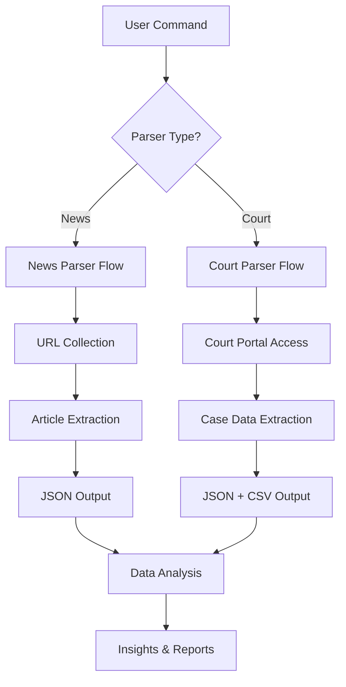

## Data Flow Architecture

### News Scraping Flow

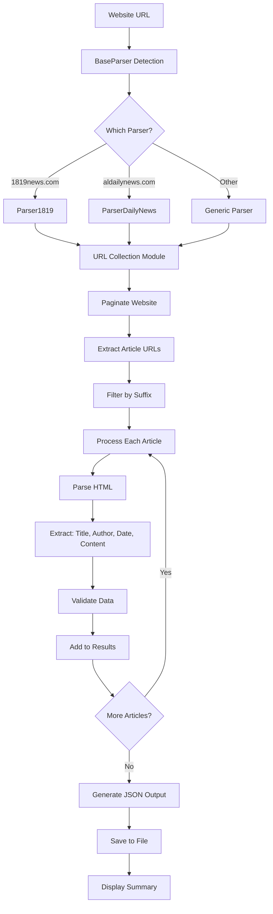

### Court Scraping Flow

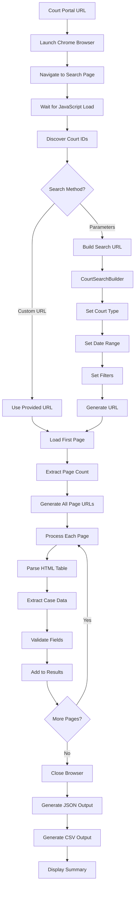

## Parser Selection Decision Tree

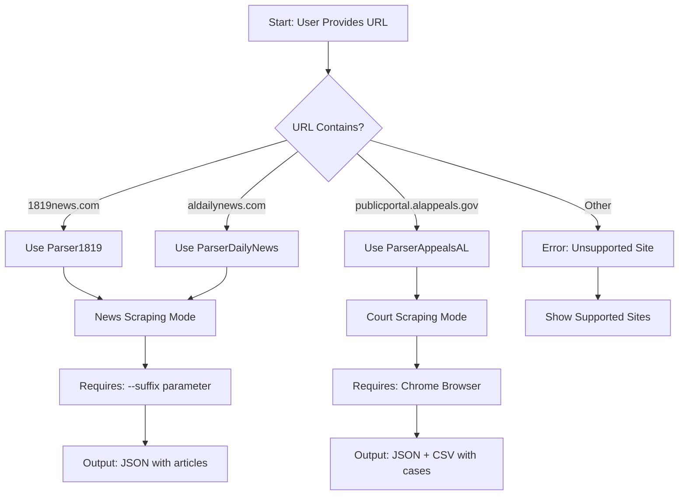

## Pagination Handling

### News Site Pagination

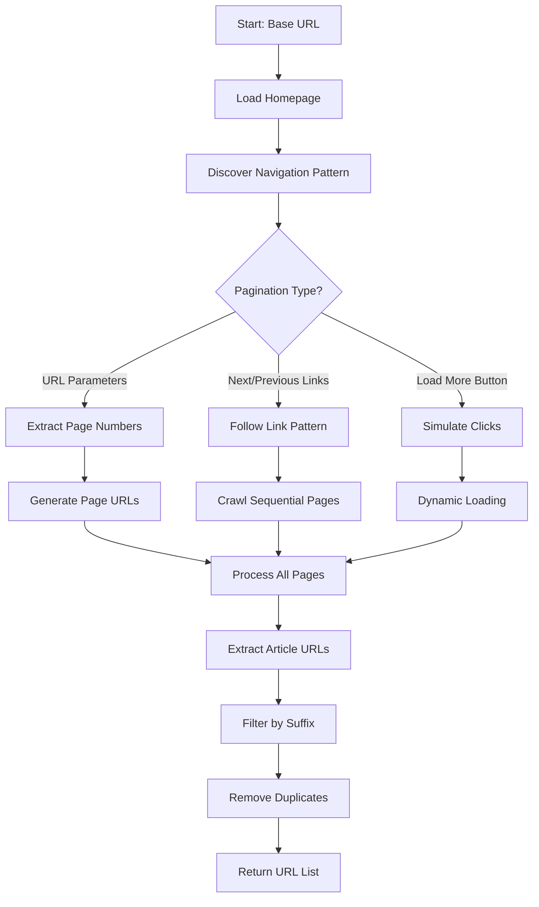

### Court Portal Pagination

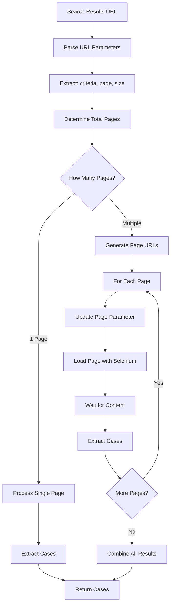

## Data Transformation Process

### News Article Transformation

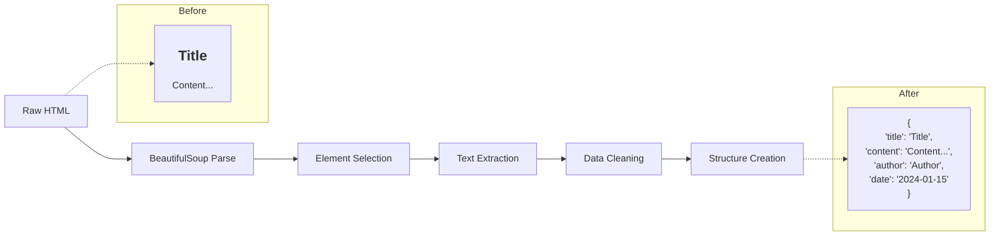

### Court Case Transformation

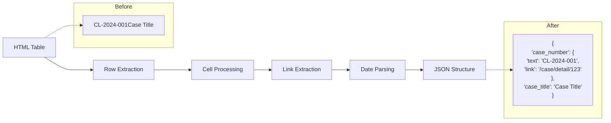

## Error Handling Flow

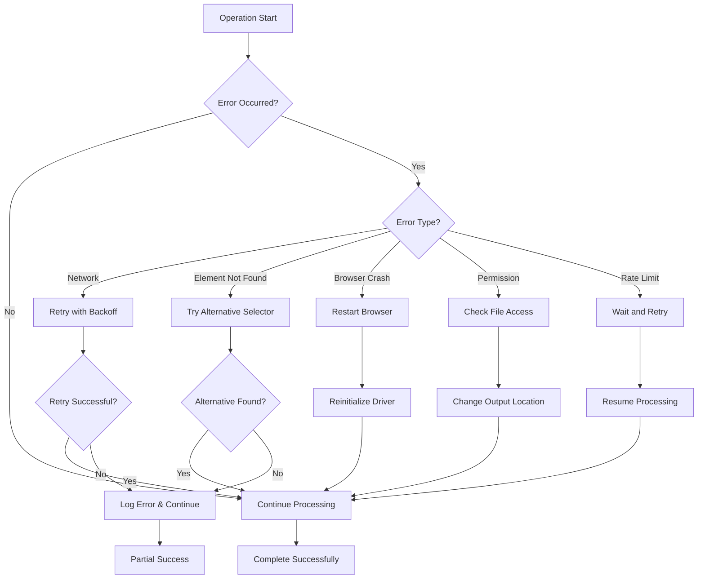

## Integration Architecture

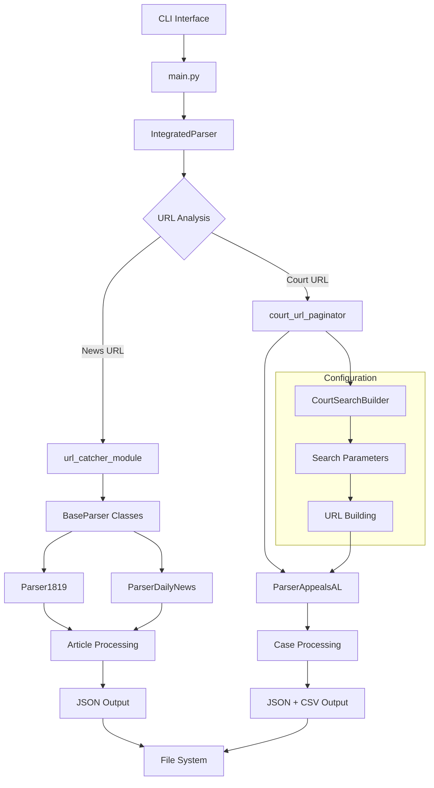

## Performance Optimization Flow

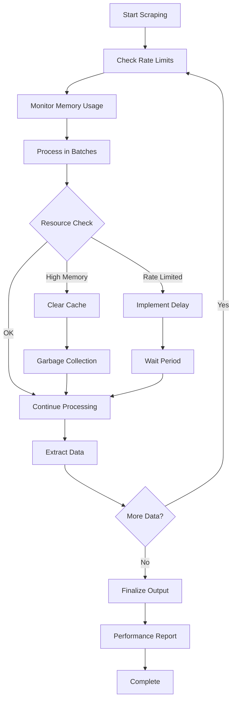

## Command Processing Flow

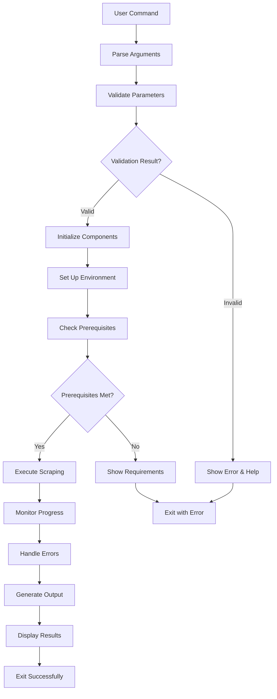

## Session Management (Court Scraping)

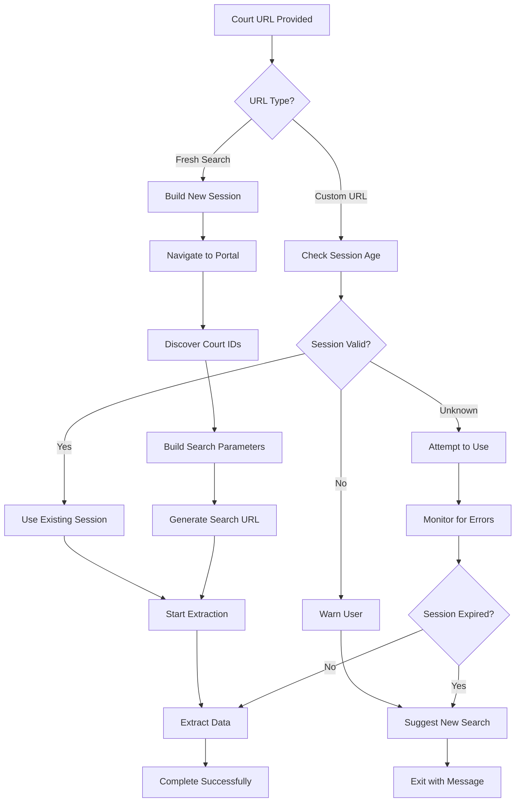

## Visual Summary

These diagrams show how OPAL:

1. **Processes different types of content** (news vs court data)
2. **Handles complex pagination** across different website structures  
3. **Makes intelligent parser selections** based on URL patterns
4. **Transforms raw HTML** into structured, usable data
5. **Manages errors gracefully** with fallback strategies
6. **Optimizes performance** through batching and rate limiting
7. **Handles browser sessions** for JavaScript-heavy sites

Understanding these flows helps you:
- **Debug issues** by following the process step-by-step
- **Optimize your scraping** by understanding bottlenecks
- **Extend OPAL** by knowing where to add new functionality
- **Troubleshoot errors** by identifying which component failed

For more technical details, see the [Developer Guide](../developer/architecture.md).

For practical usage examples, see [Common Use Cases](common-use-cases.md).