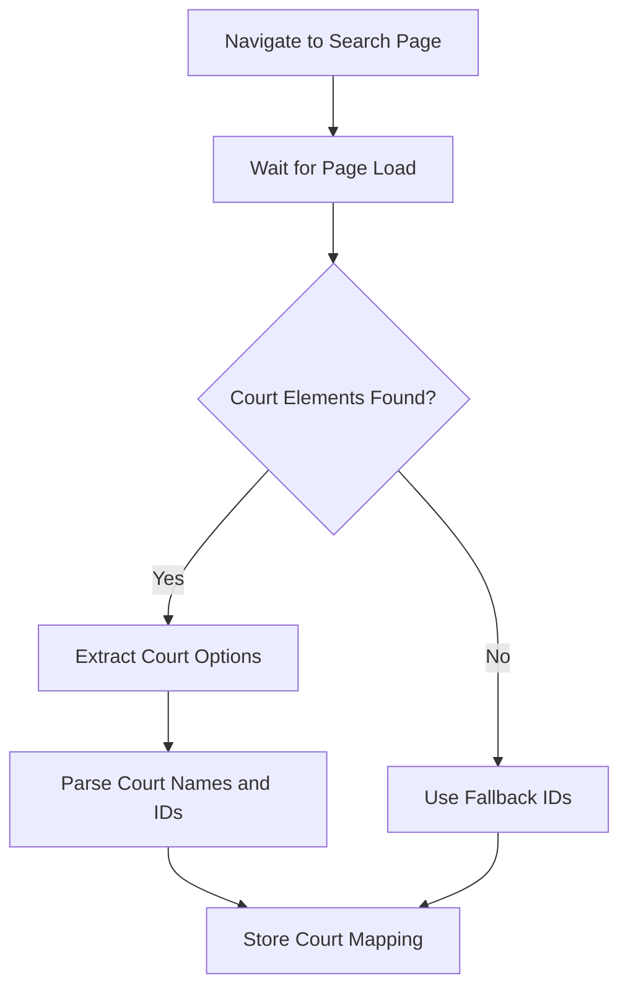
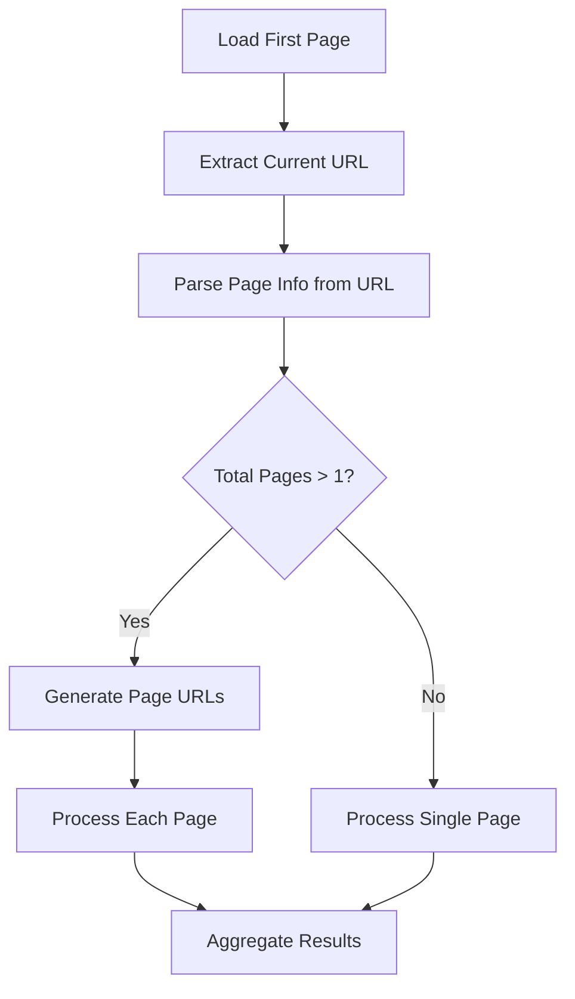
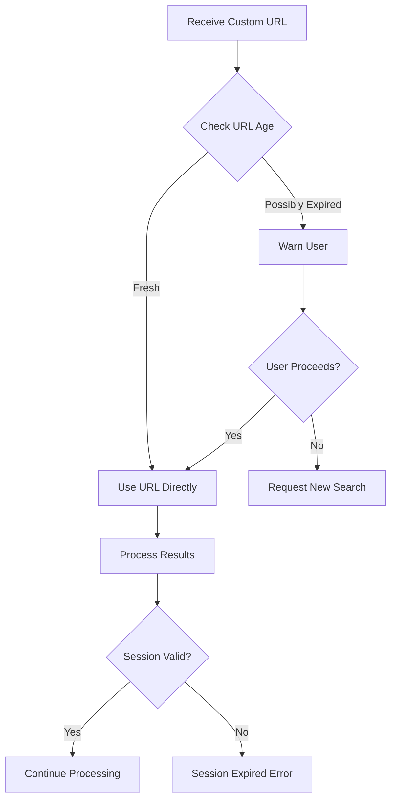
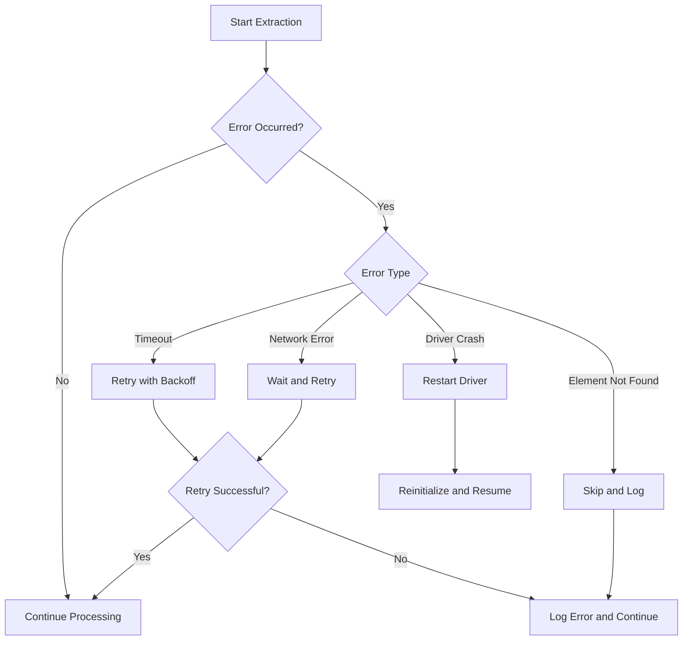
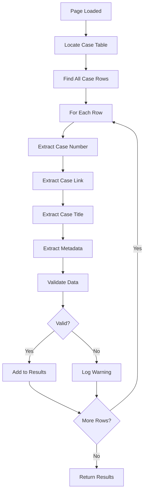
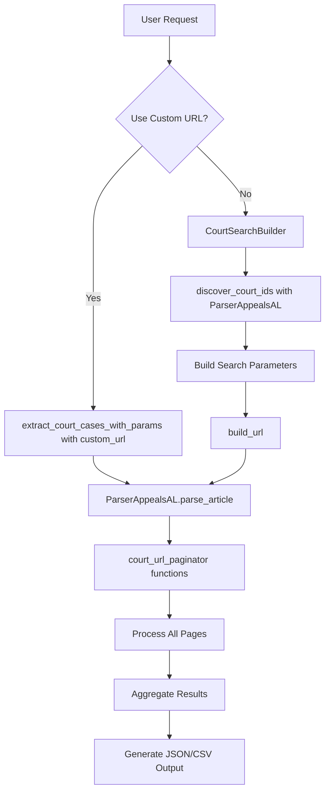
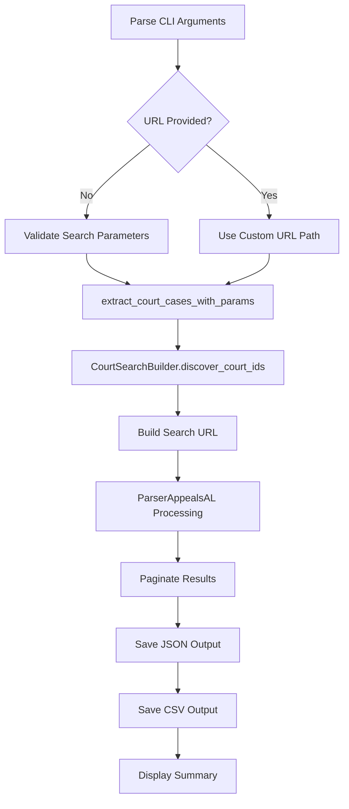
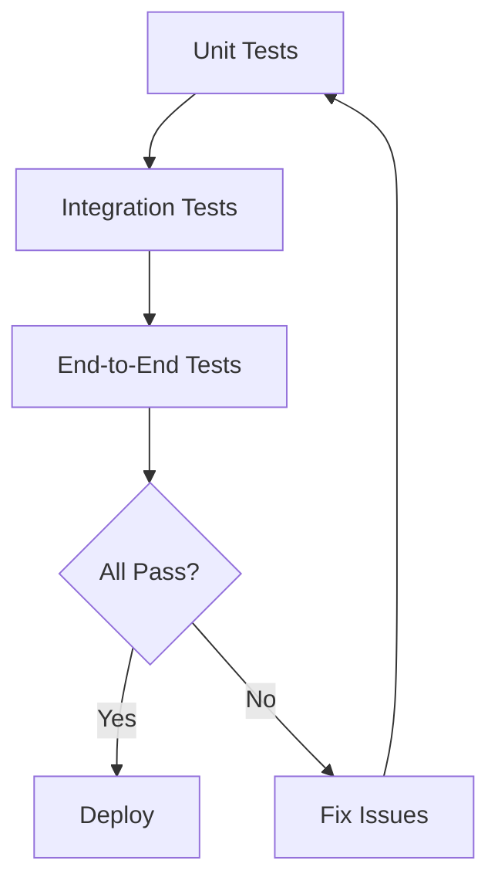

# Workflows

This document describes the internal workflows and processing patterns used by OPAL parsers, particularly focusing on the court parsing system.

## Court ID Discovery Workflow

The CourtSearchBuilder automatically discovers available courts and their IDs from the Alabama Appeals Court portal:



### Implementation Details

1. **Navigation**: Load `https://publicportal.alappeals.gov/portal/search/case`
2. **Element Detection**: Look for court selection elements
3. **Data Extraction**: Parse option elements for court names and values
4. **Fallback Strategy**: Use known court ID for civil court if discovery fails

```python
# Actual implementation in CourtSearchBuilder
def discover_court_ids(self, parser_instance):
    try:
        # Navigate to search page
        parser_instance.driver.get("https://publicportal.alappeals.gov/portal/search/case")
        
        # Wait for page load
        time.sleep(3)
        
        # Try to find court selection elements
        court_elements = parser_instance.driver.find_elements(
            By.XPATH, 
            "//select[@id='court'] | //select[contains(@name, 'court')] | //div[contains(@class, 'court')]"
        )
        
        if court_elements:
            # Extract court IDs from dropdown options
            for element in court_elements:
                options = element.find_elements(By.TAG_NAME, "option")
                for option in options:
                    court_name = option.text.lower()
                    court_id = option.get_attribute("value")
                    
                    # Map court names to internal keys
                    if "civil" in court_name and "appeals" in court_name:
                        self.courts['civil']['id'] = court_id
                    elif "criminal" in court_name and "appeals" in court_name:
                        self.courts['criminal']['id'] = court_id
                    elif "supreme" in court_name:
                        self.courts['supreme']['id'] = court_id
        else:
            # Use known working ID for civil court
            self.courts['civil']['id'] = '68f021c4-6a44-4735-9a76-5360b2e8af13'
            
    except Exception as e:
        # Fallback to known civil court ID
        self.courts['civil']['id'] = '68f021c4-6a44-4735-9a76-5360b2e8af13'
```

## Dynamic Pagination Workflow

The system handles JavaScript-based pagination:



### Steps:

1. **Initial Load**: Load search results first page
2. **URL Analysis**: Extract pagination data from JavaScript-updated URL
3. **Page Generation**: Create URLs for all result pages
4. **Sequential Processing**: Load and extract data from each page
5. **Result Aggregation**: Combine all extracted cases

## Session Management Workflow

Handling session-based URLs and expiration:



### Key Considerations:

- URLs contain session tokens that expire after ~30 minutes
- System warns users about potentially expired URLs
- Provides clear error messages when sessions expire
- Suggests creating new search for expired sessions

## Error Recovery Workflow

Robust error handling throughout the extraction process:



### Error Types and Handling:

1. **Selenium Timeouts**: Retry with exponential backoff
2. **Stale Elements**: Re-locate elements before interaction
3. **Driver Crashes**: Restart driver and resume from last page
4. **Network Errors**: Implement retry logic with delays

## Data Extraction Workflow

Extracting case information from court pages:



### Data Points Extracted:

- Case number and detail link
- Case title
- Court name
- Classification/type
- Filing date
- Current status

## Integration Workflow

How OPAL components work together:



## Command-Line Workflow

Processing flow for CLI usage:



## Performance Optimization Workflow

Strategies for efficient extraction:

1. **Batch Processing**
   - Process multiple pages concurrently where possible
   - Aggregate results before writing to disk

2. **Caching Strategy**
   - Cache court IDs after discovery
   - Reuse WebDriver instance across pages

3. **Rate Limiting**
   - Implement delays between requests
   - Respect server resources

4. **Memory Management**
   - Process large result sets in chunks
   - Clear driver cache periodically

## Testing Workflow

Ensuring reliability:



### Test Categories:

1. **Unit Tests**: Individual function testing
2. **Integration Tests**: Component interaction
3. **End-to-End Tests**: Full extraction workflows
4. **Performance Tests**: Load and speed testing

## Debugging Workflow

Troubleshooting extraction issues:

1. **Enable Debug Logging**
   ```python
   import logging
   logging.basicConfig(level=logging.DEBUG)
   ```

2. **Run in Non-Headless Mode**
   ```python
   parser = ParserAppealsAL(headless=False)
   ```

3. **Add Breakpoints**
   - Inspect page state
   - Verify element selection
   - Check data extraction

4. **Save Screenshots**
   ```python
   driver.save_screenshot("debug_state.png")
   ```

5. **Export Page Source**
   ```python
   with open("page_source.html", "w") as f:
       f.write(driver.page_source)
   ```